# System Architecture

## Overview
This document provides a visual representation of the system architecture for the Ekiden AI Access platform.

## System Architecture Diagram

```mermaid
graph TB
    subgraph "Client Applications"
        AdminApp["Admin App<br/>(Vue.js + Vuetify)"]
        AthleteApp["Athlete App<br/>(Vue.js + Vuetify)"]
        CoachApp["Coach App<br/>(Vue.js + Vuetify)"]
    end

    subgraph "External Services"
        Stripe["Stripe<br/>(Payment Processing)"]
        
        subgraph "LLM Providers"
            GPT["OpenAI GPT"]
            Claude["Anthropic Claude"]
            Gemini["Google Gemini"]
        end
        
        subgraph "Fitness Integrations"
            Garmin["Garmin"]
            Strava["Strava"]
            Whoop["Whoop"]
            Polar["Polar"]
            Coros["Coros"]
        end
    end

    subgraph "Firebase Services"
        Hosting["Firebase Hosting"]
        Auth["Firebase Authentication"]
        Firestore["Firebase Firestore"]
        Functions["Firebase Cloud Functions"]
        Storage["Firebase Storage<br/>(FIT Files)"]
    end

    %% Client to Firebase Hosting
    AdminApp -->|Hosted on| Hosting
    AthleteApp -->|Hosted on| Hosting
    CoachApp -->|Hosted on| Hosting

    %% Client to Firebase Services
    AdminApp -->|Authenticate| Auth
    AthleteApp -->|Authenticate| Auth
    CoachApp -->|Authenticate| Auth

    AdminApp -->|Read/Write Data| Firestore
    AthleteApp -->|Read/Write Data| Firestore
    CoachApp -->|Read/Write Data| Firestore

    AdminApp -->|API Calls| Functions
    AthleteApp -->|API Calls| Functions
    CoachApp -->|API Calls| Functions

    %% Athlete App to Stripe
    AthleteApp -->|Payment Method Input| Stripe

    %% Functions to Firestore
    Functions -->|Store/Retrieve Data| Firestore

    %% Functions to Cloud Storage
    Functions -->|Store FIT Files| Storage
    Storage -->|Retrieve FIT Files| Functions

    %% Functions to External Services
    Functions -->|Process Payments| Stripe
    Functions -->|AI Requests| GPT
    Functions -->|AI Requests| Claude
    Functions -->|AI Requests| Gemini

    %% Functions to Fitness Services
    Functions -->|Sync Data| Garmin
    Functions -->|Sync Data| Strava
    Functions -->|Sync Data| Whoop
    Functions -->|Sync Data| Polar
    Functions -->|Sync Data| Coros

    %% Fitness Services Webhooks
    Garmin -.->|Webhook: New Data| Functions
    Strava -.->|Webhook: New Data| Functions
    Whoop -.->|Webhook: New Data| Functions
    Polar -.->|Webhook: New Data| Functions
    Coros -.->|Webhook: New Data| Functions

    %% Firestore Triggers
    Firestore -.->|Triggers| Functions

    %% Styling
    classDef clientStyle fill:#42b883,stroke:#35495e,stroke-width:2px,color:#fff
    classDef firebaseStyle fill:#FFA611,stroke:#F57C00,stroke-width:2px,color:#fff
    classDef externalStyle fill:#6772E5,stroke:#5469d4,stroke-width:2px,color:#fff
    classDef llmStyle fill:#10a37f,stroke:#0d8a6a,stroke-width:2px,color:#fff
    classDef fitnessStyle fill:#FC4C02,stroke:#d43f00,stroke-width:2px,color:#fff

    class AdminApp,AthleteApp,CoachApp clientStyle
    class Hosting,Auth,Firestore,Functions,Storage firebaseStyle
    class Stripe externalStyle
    class GPT,Claude,Gemini llmStyle
    class Garmin,Strava,Whoop,Polar,Coros fitnessStyle
```

## Component Details

### Client Applications
- **Admin App**: Administrative interface for platform management
- **Athlete App**: Interface for athletes to track performance and interact with coaches
- **Coach App**: Interface for coaches to manage athletes and create training plans

### Firebase Services
- **Firebase Hosting**: Serves the three Vue.js applications
- **Firebase Authentication**: Handles user authentication and authorization
- **Firebase Firestore**: NoSQL database for storing all application data
- **Firebase Cloud Functions**: Serverless backend for business logic and integrations
- **Firebase Storage**: Object storage for FIT files received from fitness devices (Garmin, Strava, Whoop, Polar, Coros)

### External Services
- **Stripe**: Payment processing for subscriptions and purchases
- **LLM Providers**: 
  - OpenAI GPT: AI-powered coaching and insights
  - Anthropic Claude: Alternative AI model for natural language processing
  - Google Gemini: Additional AI capabilities
- **Fitness Integrations**: Data synchronization from various fitness platforms. These platforms send webhook notifications to Cloud Functions when new activity or health data is available.

## Data Flow

1. Users access the appropriate app (Admin/Athlete/Coach) via Firebase Hosting
2. Authentication is handled through Firebase Authentication
3. Clients interact with Firebase Firestore for real-time data operations
4. Complex business logic and external integrations are handled by Cloud Functions
5. Cloud Functions process payments through Stripe
6. Cloud Functions utilize LLM services for AI-powered features
7. Cloud Functions sync fitness data from connected platforms
8. FIT files from fitness devices are stored in Firebase Storage for later processing
9. Fitness platforms send webhook notifications to Cloud Functions when new activity or health data is available
10. Firestore triggers activate Cloud Functions for data processing and notifications
