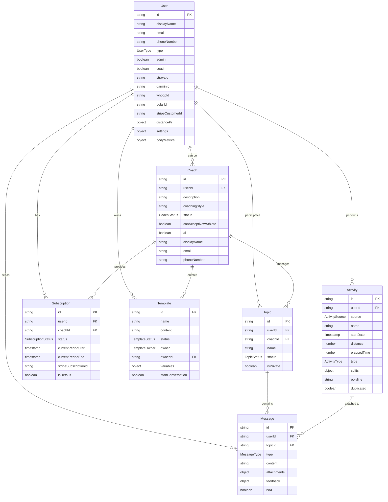
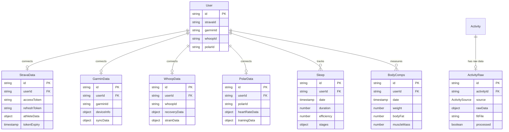
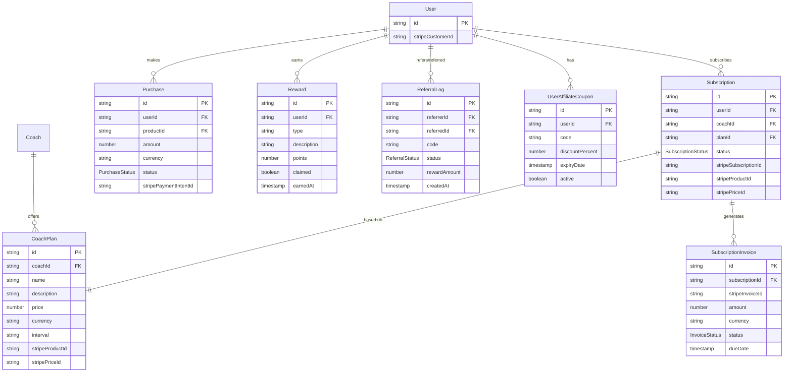
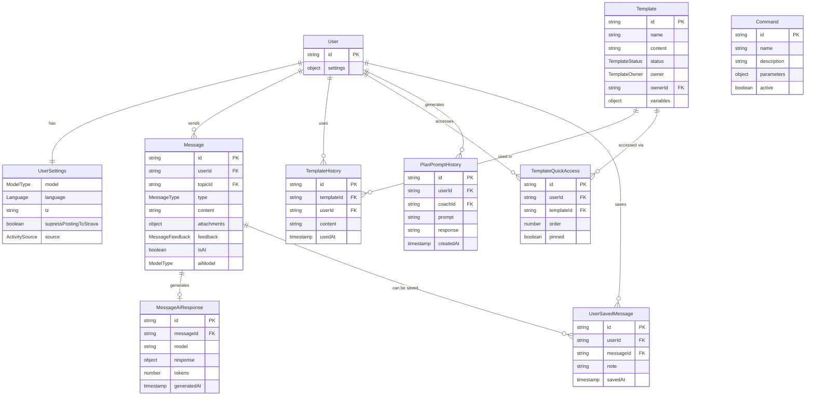
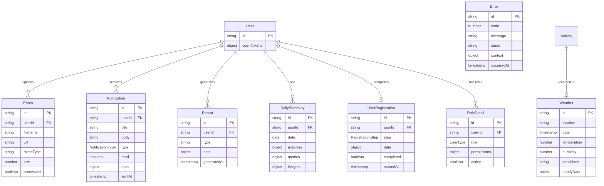

# Database Schema Overview - Ekiden AI Platform

## Core Platform Entities

These are the fundamental building blocks of our platform, representing users, coaches, activities, and communication systems.

## Business & Subscription Management

## AI Coaching & Communication System

## Platform Infrastructure & Utilities

## Data flow

### 🚀 **User Journey Flow**

1. **Getting Started**: A new **User** registers and completes their **UserRegistration** process
2. **Role Evolution**: Users can register as a **Coach**, expanding the platform's expertise. However, at the moment, only System AI Coach are available.
3. **Device Connection**: Users connect their favorite fitness devices (**Strava**, **Garmin**, **Whoop**, **Polar**)
4. **Activity Tracking**: The platform automatically captures **Activities** from connected devices
5. **Coaching Services**: Users can subscribe to **Coach** services through our **Subscription** system

### 💬 **Communication & AI Interaction Flow**

1. **Real-time Communication**: **Users** and **Coaches** communicate via **Messages** within dedicated **Topics**
2. **AI-Powered Responses**: When a **User** sends a message to a **Topic** with an AI **Coach**, our system automatically generates intelligent responses
3. **Proactive Coaching**: After each **Activity** upload, our AI generates personalized feedback messages and sends them directly to the **User**

### 📊 **Data Processing Pipeline**

1. **Activity Capture**: Users wear their sports watches during workouts and runs
2. **Raw Data Ingestion**: When activities finish, device manufacturers send **ActivityRaw** data including detailed summaries and FIT files
3. **Data Standardization**: Our system processes **ActivityRaw** data and transforms it into standardized **Activity** records for consistent analysis and coaching insights
